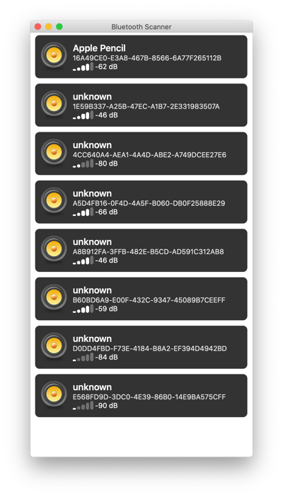
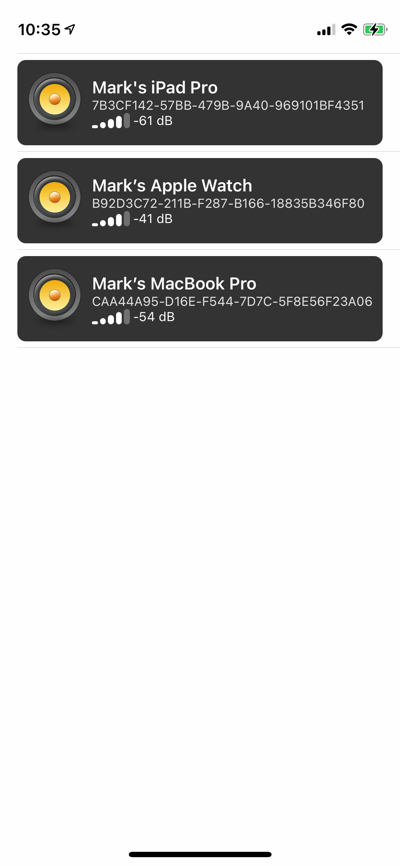

# Bluetooth Scanner

An experimental playground for working with CoreBluetooth.  The app is cross platform (mac and iOS) and lists all the Bluetooth devices CoreBluetooth reports.

At present this is all it does, but in time I'll probably add the ability to view the details of each device (services, characteristics, etc.).

## Mac

## iOS

